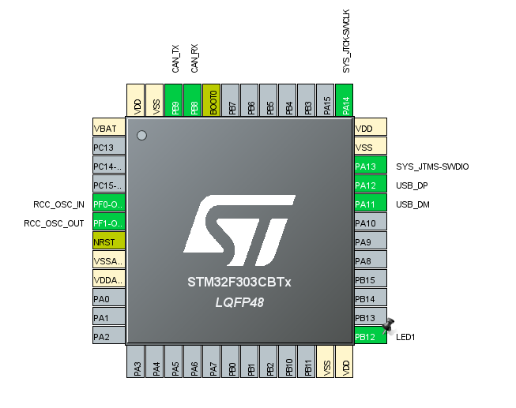

# STM32-CAN-Busadapter
CAN adapter on MCU stm32f303cb

* STM32CubeIDE V1.1.0
* STM32Cube FW_F3 V1.11.0

Support CAN speed:
* 10Kbit (CAN_BS1_13TQ; CAN_BS2_2TQ);
* 20Kbit (CAN_BS1_16TQ; CAN_BS2_3TQ);
* 50Kbit (CAN_BS1_13TQ; CAN_BS2_2TQ);
* 100Kbit (CAN_BS1_16TQ; CAN_BS2_3TQ);
* 125Kbit (CAN_BS1_13TQ; CAN_BS2_2TQ);
* 250Kbit (CAN_BS1_13TQ; CAN_BS2_2TQ);
* 500Kbit (CAN_BS1_5TQ; CAN_BS2_2TQ;

Foto this device

 
